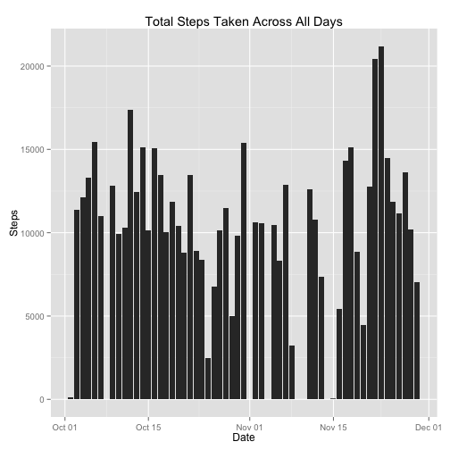
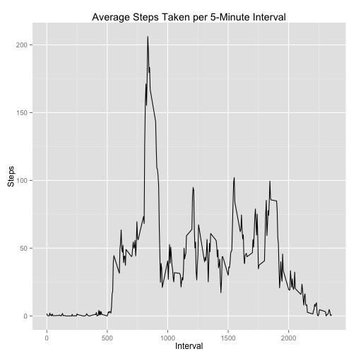
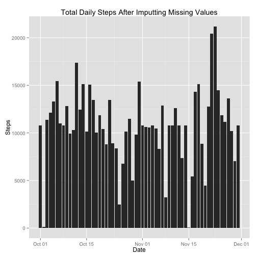
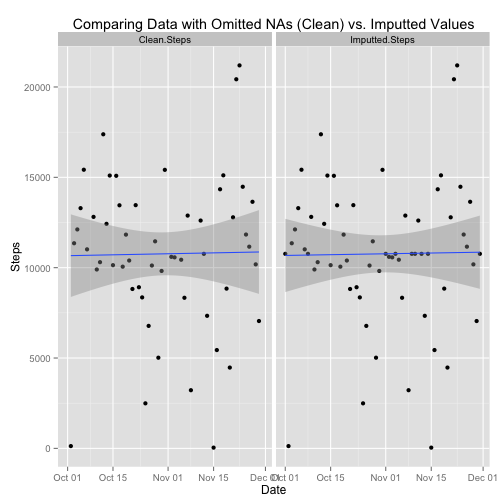
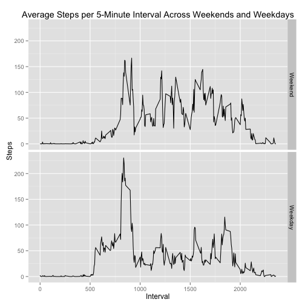

#Reproducible Research: Peer Assessment 1

## Loading and preprocessing the data

To help make our lives easier, we're using `dpylyr`, `lubridate`, `ggplot2` and `reshape` packages.


```r
library(dplyr)
library(lubridate)
library(ggplot2)
library(reshape)
```

To download and process the data, we start by unzipping the ZIP file existing in
the baseline Git fork and loading it into `data` using `read.csv`.  We immediately
convert it into a data table, then add two factor columns to prepare the data
to answer our questions below.  Finally, we clean data by ommiting NA's and
save it to a separate table called `data_clean`.


```r
#setwd("~/Box Sync/Play/datasciencecoursera/Reproducible Research/RepData_PeerAssessment1/")
data <- read.csv(unz("activity.zip","activity.csv"), header=TRUE, stringsAsFactors=FALSE)
data <- tbl_df(data)
data <- mutate(data, date = as.POSIXct(date, format = "%Y-%m-%d"))
data <- mutate(data, weekday = wday(date), 
               weekpart = ifelse(weekday == 1 | weekday == 7, 1, 2))
data$weekday <- factor(data$weekday,
                       levels = c(1,2,3,4,5,6,7),
                       labels = c("Sunday", "Monday", "Tuesday", "Wednesday", 
                              "Thursday", "Friday", "Saturday"))
data$weekpart <- factor(data$weekpart,
                        levels = c(1,2),
                        labels = c("Weekend", "Weekday"))
data_clean <- na.omit(data)
```

## What is mean total number of steps taken per day?
For this part of the assignment, you can ignore the missing values in the dataset.

1. Make a histogram of the total number of steps taken each day.


```r
data_by_date <- aggregate(data_clean[, "steps"], 
                          by=list(data_clean$date), 
                          FUN=sum)
names(data_by_date) <- c("Date", "Steps")
qplot(Date, Steps, data=data_by_date, geom="histogram", stat="identity",
      main="Total Steps Taken Across All Days")
```

 

2. Calculate and report the mean and median total number of steps taken per day.

```r
mean(data_by_date$Steps)
```

```
## [1] 10766.19
```

```r
median(data_by_date$Steps)
```

```
## [1] 10765
```

## What is the average daily activity pattern?

1. Make a time series plot (i.e. type = "l") of the 5-minute interval (x-axis)
and the average number of steps taken, averaged across all days (y-axis).

To do this, we'll aggregate data by interval, name it properly, then create a 
line graph using qplot.


```r
data_by_interval <- aggregate(data_clean[, "steps"], 
                              by=list(data_clean$interval),
                              FUN=mean)
names(data_by_interval)[1] <- "interval"
qplot(interval, steps, data=data_by_interval, geom="line",
      xlab="Interval", ylab="Steps", 
      main="Average Steps Taken per 5-Minute Interval")
```

 

2. Which 5-minute interval, on average across all the days in the dataset, contains the maximum number of steps?


```r
data_by_interval[data_by_interval$steps == max(data_by_interval$steps), 
                 "interval"]
```

```
## [1] 835
```

It appears we're looking at the data of someone who prefers to be active in the morning, between the hours of 8am-9am.

## Imputing missing values
Note that there are a number of days/intervals where there are missing values (coded as NA). The presence of missing days may introduce bias into some calculations or summaries of the data.

1. Calculate and report the total number of missing values in the dataset (i.e. the total number of rows with NAs).


```r
missing_data <- (data[!complete.cases(data),])
nrow(missing_data)
```

```
## [1] 2304
```

2. Devise a strategy for filling in all of the missing values in the dataset. The strategy does not need to be sophisticated. For example, you could use the mean/median for that day, or the mean for that 5-minute interval, etc.

We plan to fill all missing values with the mean of the missing 5-minute interval over the 2 month period, as you can see in the code below under point #3.

3. Create a new dataset that is equal to the original dataset but with the missing data filled in.

We merge the `missing_data` data table with `data_by_interval` to fill in the missing data points with the mean interval.  Then, we bind it to the `data_clean` data table since we already omitted NAs from that table.


```r
data_merged <- merge(missing_data, data_by_interval, by="interval")
names(data_merged)[6] <- "steps"
data_imput_missing <- rbind(data_clean, 
                            data_merged[, c("steps","date","interval","weekday","weekpart")])
```

4. Make a histogram of the total number of steps taken each day.  Calculate and report the mean and median total number of steps taken per day.


```r
data_by_date_imputted <- aggregate(data_imput_missing[, "steps"], 
                          by=list(data_imput_missing$date), 
                          FUN=sum)
names(data_by_date_imputted) <- c("Date", "Steps")
qplot(Date, Steps, data=data_by_date_imputted, geom="histogram", stat="identity",
      main="Total Daily Steps After Imputting Missing Values")
```

 


```r
mean(data_by_date_imputted$Steps)
```

```
## [1] 10766.19
```

```r
median(data_by_date_imputted$Steps)
```

```
## [1] 10766.19
```

Do these values differ from the estimates from the first part of the assignment? What is the impact of imputing missing data on the estimates of the total daily number of steps?


```r
compare_imputted_clean <- merge(data_by_date, data_by_date_imputted, 
                                by="Date", all.y=TRUE)
names(compare_imputted_clean) <- c("Date", "Clean.Steps", "Imputted.Steps")
melted <- melt(compare_imputted_clean, id="Date")
qplot(Date, value, data=melted, facets=.~variable, 
      geom=c("point","smooth"), method="lm",
      ylab="Steps",
      main="Comparing Data with Omitted NAs (Clean) vs. Imputted Values")
```

```
## Warning: Removed 8 rows containing missing values (stat_smooth).
```

```
## Warning: Removed 8 rows containing missing values (geom_point).
```

 

Based on the graph above, we see very little impact to the overall result after imputting data.  It does appear the regression line flattens a bit and the standard deviation narrows with imputation.

## Are there differences in activity patterns between weekdays and weekends?
For this part the weekdays() function may be of some help here. Use the dataset with the filled-in missing values for this part.

1. Create a new factor variable in the dataset with two levels – “weekday” and “weekend” indicating whether a given date is a weekday or weekend day.

We already did this in the data processing step (#1) by adding a factor variable called `weekpart`.

2. Make a panel plot containing a time series plot (i.e. type = "l") of the 5-minute interval (x-axis) and the average number of steps taken, averaged across all weekday days or weekend days (y-axis). See the README file in the GitHub repository to see an example of what this plot should look like using simulated data.


```r
compare_weekend <- aggregate(data_imput_missing[, "steps"], 
                    by=list(data_imput_missing$interval, data_imput_missing$weekpart), 
                    FUN=mean)
names(compare_weekend) <- c("Interval", "Weekpart", "Steps")
qplot(Interval, Steps, data=compare_weekend, facets=Weekpart~., geom="line",
      main="Average Steps per 5-Minute Interval Across Weekends and Weekdays")
```

 

Finally I created the md, html and figure files using `knit2html()`.  Here's an example, although it's commented out so RStudio's knitR doesn't execute it.


```r
#knit2html("PA1_template.Rmd")
```
